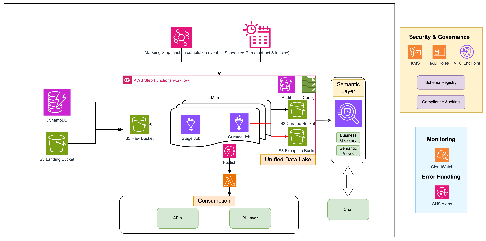

# UDM (Unified Data Model) Utility

## Overview

The UDM (Unified Data Model) Utility is a standalone, reusable data processing framework built on AWS that implements a medallion architecture (Bronze, Silver, Gold layers) for standardizing and transforming data from various sources into a consistent, analytics-ready format.

It provides an event-driven, serverless pipeline that ingests raw data from sources such as DynamoDB tables and S3 files, applies configurable transformation and cleansing logic, and produces curated datasets accessible via Amazon Athena. The framework is designed to be highly configurable through YAML-based pipeline definitions, enabling teams to onboard new data sources without writing custom ETL code. Built-in audit trails, failure notifications, and downstream integration capabilities support operational requirements across multiple environments.

> **Disclaimer**: This sample code is provided for demonstration and educational purposes. It is not intended for direct production deployment without additional security review, testing, and hardening appropriate to your organization's requirements.

## Key Features

- **Event-Driven Architecture**: Automatically triggers processing based on S3 events, Step Function completions, or scheduled intervals
- **Medallion Architecture**: Implements Bronze (Raw), Silver (Curated), and Gold (Semantic) data layers
- **Multi-Source Support**: Processes data from DynamoDB tables, S3 files (JSON, Excel), and other AWS services
- **Configurable Pipelines**: YAML-based configuration for flexible data processing workflows
- **Downstream Integration**: Automatic triggering of downstream services upon completion
- **Audit & Monitoring**: Built-in audit trails and SNS notifications for pipeline status
- **Apache Iceberg Support**: Uses Iceberg table format for efficient data management

## Architecture



### Data Flow

1. **Ingestion Layer**: EventBridge rules trigger the UDM pipeline based on S3 events, Step Function completions, or schedules
2. **Bronze Layer (Raw)**: Stage Glue job reads from DynamoDB/S3 and writes raw data to S3 in Iceberg format
3. **Silver Layer (Curated)**: Curated Glue job transforms and cleanses data with business logic
4. **Gold Layer (Semantic)**: Lambda creates Athena views for business consumption
5. **Downstream Integration**: SNS notifications trigger downstream services upon completion

### Components

- **AWS Glue Jobs**: Data processing and transformation
- **AWS Step Functions**: Workflow orchestration
- **AWS Lambda**: Lightweight processing and downstream triggers
- **Amazon EventBridge**: Event-driven triggers
- **Amazon S3**: Data storage (Iceberg warehouse)
- **Amazon DynamoDB**: Audit and metadata storage
- **Amazon SNS**: Notifications and downstream integration
- **Amazon Athena**: Semantic layer queries

## Directory Structure

```
udm-utility/
├── infrastructure/
│   └── udm/                    # Terraform infrastructure code
│       ├── components/            # Terraform resource definitions
│       ├── config/                # Pipeline and EventBridge configurations
│       ├── tfvars/                # Environment-specific variables
│       └── README.md              # Detailed infrastructure documentation
├── src/
│   ├── glue/
│   │   └── udm/                   # Glue job scripts
│   │       ├── curation/          # Curated layer processing
│   │       ├── stage/             # Stage layer processing
│   │       └── utils/             # Reusable utilities
│   ├── lambdas/
│   │   └── udm/                   # Lambda function code
│   │       ├── downstream_trigger/
│   │       ├── semantic_view/
│   │       └── helper/
│   ├── lambda-layers/
│   │   └── udm/                   # Lambda layer dependencies
│   ├── step-function-asls/
│   │   └── udm/                   # Step Function definitions
│   ├── udm/
│   │   └── udm_whl/               # UDM Python wheel package
│   └── global_utils/              # Shared utilities
├── tests/
│   ├── unit-tests/                # Unit tests
│   ├── integration-tests/         # Integration tests
│   └── regression-testing/        # Regression tests
├── .github/
│   └── workflows/
│       └── udm-infra.yaml         # CI/CD pipeline
├── configs/                       # Sample configuration files
└── README.md                      # This file
```

## Prerequisites

- AWS Account with appropriate permissions
- Terraform >= 1.5
- Python 3.12
- AWS CLI configured
- GitHub Actions (optional, for CI/CD)

## Deployment

### Step 1: Prerequisites

```bash
# Verify prerequisites
terraform --version   # >= 1.5
python3 --version     # >= 3.12
aws --version         # AWS CLI v2
aws sts get-caller-identity  # Verify AWS credentials
```

### Step 2: Clone and Configure

```bash
git clone https://github.com/aws-samples/aws-unified-data-platform.git
cd aws-unified-data-platform

# Create your environment config from the example
cp infrastructure/udm/tfvars/example.tfvars infrastructure/udm/tfvars/dev.tfvars
```

Edit `infrastructure/udm/tfvars/dev.tfvars` with your values:

```hcl
region     = "us-east-1"    # Your AWS region
env_suffix = "dev"          # Environment name (dev, staging, prod, etc.)
```

### Step 3: Set Up Config Files

The framework requires config files matching your `env_suffix`. Create them from the provided examples:

```bash
cd infrastructure/udm/config

# Notification config (required)
mkdir -p notifications/dev
cp notifications/dev/notifications.yaml notifications/<your-env>/notifications.yaml

# EventBridge rules (required)
mkdir -p eventbridge-rules/dev
cp eventbridge-rules/dev/rules.yaml eventbridge-rules/<your-env>/rules.yaml

# Pipeline configs (add as needed)
mkdir -p pipeline/dev
cp pipeline/example/dynamodb-source-example.yaml pipeline/dev/my-table-dev.yaml

# Downstream configs (add as needed)
mkdir -p downstream/dev
cp downstream/example/config.yaml downstream/dev/config.yaml
```

### Step 4: Deploy Infrastructure

```bash
cd infrastructure/udm

# Initialize Terraform
terraform init

# Preview changes
terraform plan -var-file=tfvars/dev.tfvars

# Deploy
terraform apply -var-file=tfvars/dev.tfvars
```

This creates all AWS resources: S3 buckets, Glue jobs, Step Functions, Lambda functions, EventBridge rules, DynamoDB audit table, SNS topics, and IAM roles.

### Step 5: Upload Pipeline Configs to S3

```bash
# Get your account ID and region
export AWS_ACCOUNT_ID=$(aws sts get-caller-identity --query Account --output text)
export AWS_REGION=us-east-1
export ENV=dev

# Sync pipeline and downstream configs to S3
aws s3 sync config/pipeline/$ENV s3://aws-samples-config-${AWS_ACCOUNT_ID}-${AWS_REGION}-${ENV}/udm/pipeline/ --delete
aws s3 sync config/downstream/$ENV s3://aws-samples-config-${AWS_ACCOUNT_ID}-${AWS_REGION}-${ENV}/udm/downstream/ --delete
```

### Step 6: Run the Pipeline

```bash
# Trigger the pipeline via AWS CLI
aws stepfunctions start-execution \
  --state-machine-arn arn:aws:states:${AWS_REGION}:${AWS_ACCOUNT_ID}:stateMachine:aws-samples-udm-pipeline-${ENV} \
  --input '{"tables_list": ["my-table-dev"]}'
```

You can also trigger pipelines via EventBridge rules configured in Step 3.

### Step 7: Verify

```bash
# Check Step Function execution
aws stepfunctions list-executions \
  --state-machine-arn arn:aws:states:${AWS_REGION}:${AWS_ACCOUNT_ID}:stateMachine:aws-samples-udm-pipeline-${ENV} \
  --max-results 5

# Check audit table
aws dynamodb scan --table-name aws-samples-udm-audit-table-${ENV} --max-items 5

# Query curated data via Athena
aws athena start-query-execution \
  --query-string "SELECT * FROM aws_samples_udm_curated_${ENV}.my_table_curated LIMIT 10" \
  --work-group primary \
  --query-execution-context Database=aws_samples_udm_curated_${ENV}
```

### Cleanup

To destroy all resources:

```bash
cd infrastructure/udm
terraform destroy -var-file=tfvars/dev.tfvars
```

## Configuration

### Pipeline Configuration

Pipeline configurations define how data flows from source to curated layers. See [infrastructure/udm/README.md](infrastructure/udm/README.md) for detailed configuration options.

**Key Configuration Files:**
- `config/pipeline/{env}/*.yaml` - Pipeline definitions
- `config/eventbridge-rules/{env}/rules.yaml` - Event triggers
- `config/downstream/{env}/config.yaml` - Downstream integrations
- `config/notifications/{env}/notifications.yaml` - SNS notifications

### Transformation Types

- **string**: Basic string with cleaning
- **int/float/double**: Numeric types
- **date/timestamp**: Date parsing
- **value_normalization**: Value mapping
- **struct**: Nested structures
- **array_explode**: Array expansion

## Usage Examples

### Adding a New Data Source

1. Create pipeline configuration:
```yaml
source: "new_dynamodb_table"
source_type: "dynamodb"

stage:
  database_name: "udm_raw"
  target_table_name: "new_table_raw"
  
curation:
  - name: "new_table_curated"
    database_name: "udm_curated"
    target_table_name: "new_table_curated"
    load_method: "upsert"
    primary_keys: ["id"]
```

2. Add EventBridge trigger (optional):
```yaml
eventbridge_rules:
  - name: "new-table-trigger"
    rule_type: "s3_object_created"
    s3_bucket_name: "source-bucket"
    target_step_function: "aws_samples_udm_pipeline"
    input_parameters:
      tables_list: ["new_table"]
```

3. Deploy via CI/CD or Terraform

### Custom Transformations

Define column transformations in pipeline config:

```yaml
columns:
  email:
    type: "string"
    lowercase: true
    skip_cleaning: false
  
  status:
    type: "value_normalization"
    normalization_key: "status_mapping"
    corrections:
      "active": "Active"
      "inactive": "Inactive"
  
  created_date:
    type: "timestamp"
    date_overrides:
      "0000-00-00": null
```

## Monitoring & Troubleshooting

### CloudWatch Logs

- Step Functions: `/aws/stepfunctions/aws-samples-udm-pipeline-{env}`
- Glue Jobs: `/aws-glue/jobs/logs-v2/`
- Lambda Functions: `/aws/lambda/{function-name}`

### DynamoDB Audit Table

Query execution history:
```python
import boto3

dynamodb = boto3.client('dynamodb')
response = dynamodb.query(
    TableName='aws-samples-udm-audit-table-env',
    KeyConditionExpression='table_name = :table',
    ExpressionAttributeValues={':table': {'S': 'table-name'}}
)
```

### SNS Notifications

- **Failure Alerts**: `aws-samples-udm-pipeline-failure-{env}`
- **Success Notifications**: `aws-samples-udm-pipeline-downstream-{env}`

## Testing

### Unit Tests

```bash
cd tests/unit-tests
pytest udm/
```

### Integration Tests

```bash
cd tests/integration-tests
pytest udm/
```

## CI/CD Pipeline

The utility includes a GitHub Actions workflow (`.github/workflows/udm-infra.yaml`) that:

1. Runs unit tests on PRs
2. Executes Terraform plan for all environments
3. Deploys to TF → TST → QA environments sequentially
4. Syncs configuration files to S3

## Customization

### Extending the Utility

1. **Add New Glue Jobs**: Create scripts in `src/glue/udm/`
2. **Add Lambda Functions**: Create functions in `src/lambdas/udm/`
3. **Modify Step Functions**: Update ASL in `src/step-function-asls/udm/`
4. **Add Terraform Resources**: Update components in `infrastructure/udm/components/`

### Environment-Specific Configuration

Each environment (tf, tst, qa, rt) can have different:
- Pipeline configurations
- EventBridge rule enablement
- Downstream service integrations
- Notification settings
- Resource sizing

## Best Practices

1. **Configuration Management**: Use YAML files for all pipeline configurations
2. **Environment Isolation**: Maintain separate configurations per environment
3. **Idempotency**: Keep transformations idempotent
4. **Partitioning**: Partition large tables appropriately
5. **Monitoring**: Set up CloudWatch alarms for critical metrics
6. **Testing**: Test in lower environments before production
7. **Security**: Use KMS encryption for all data at rest

## Dependencies

- **AWS Services**: Glue, Step Functions, Lambda, EventBridge, S3, DynamoDB, SNS, Athena
- **Python Libraries**: boto3, pyspark, PyYAML
- **Terraform Modules**: Custom modules in `infrastructure/terraform-modules/`

## License

This library is licensed under the MIT-0 License. See the [LICENSE](LICENSE) file.

## Contributing

See [CONTRIBUTING](CONTRIBUTING.md) for more information.
